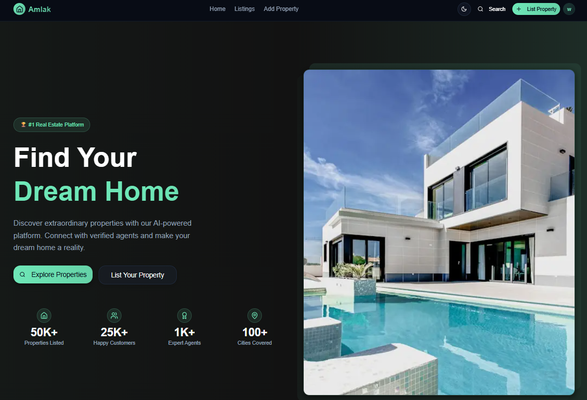

# 🏠 Amlak Real Estate Platform

[](https://nextjs.org/)
[](https://reactjs.org/)
[](https://www.typescriptlang.org/)
[](https://tailwindcss.com/)
[](https://vercel.com/)
[](LICENSE)

## 🌐 Live Demo

**🚀 [View Live Application](https://amlak-client.vercel.app/home)**

Experience the full-featured real estate platform with property browsing, user authentication, and advanced filtering capabilities. The application is deployed on Vercel with optimized performance and responsive design.



## 📋 Overview

Amlak is a modern, responsive real estate platform frontend built with Next.js 15 and TypeScript. The application enables users to browse, filter, and manage property listings with a focus on user experience and performance. Features include advanced property search, user authentication, image management, and a comprehensive property management system.

The platform is designed as a Google entry-level portfolio project, showcasing modern web development practices, clean architecture, and professional UI/UX design principles.

## ✨ Features

- 🏠 **Property Listings** - Browse properties with advanced filtering (location, price range, property type, bedrooms, bathrooms)
- 🔍 **Smart Search** - Real-time search with location-based filtering and map integration
- 🌙 **Theme Toggle** - Seamless light/dark mode with system preference detection
- 📸 **Image Management** - Multiple image upload with Cloudinary integration and carousel galleries
- 🔐 **User Authentication** - Secure JWT-based auth with HttpOnly cookies and protected routes
- 📱 **Responsive Design** - Mobile-first approach with optimized layouts for all devices
- 👤 **User Profiles** - Personal property management and user dashboard
- 🏷️ **Property Management** - Add, edit, and manage property listings with form validation
- 🗺️ **Interactive Maps** - Property location visualization with coordinate mapping
- ⚡ **Performance Optimized** - Server-side rendering, image optimization, and efficient caching
- 🎨 **Modern UI** - Clean interface built with Shadcn/UI components and Tailwind CSS
- 🔄 **Real-time Updates** - Optimistic updates and background synchronization

## 🛠️ Tech Stack

### **Framework & Language**
- **Next.js 15** - App Router with server components and streaming
- **TypeScript 5** - Full type safety with strict mode enabled
- **React 19** - Latest features with concurrent rendering

### **Styling & UI**
- **TailwindCSS 4** - Utility-first CSS framework with custom design system
- **Shadcn/UI** - Accessible component library built on Radix UI primitives
- **Lucide React** - Beautiful, customizable icon library
- **next-themes** - Theme management with system preference detection

### **State Management & Data Fetching**
- **TanStack React Query v5** - Server state management with caching and background updates
- **Axios** - HTTP client with custom interceptors and error handling
- **React Context** - Client-side state management for UI and authentication

### **Form Handling & Validation**
- **React Hook Form** - Performant forms with minimal re-renders
- **Zod** - TypeScript-first schema validation
- **@hookform/resolvers** - Seamless integration between RHF and Zod

### **File Management**
- **react-dropzone** - Drag-and-drop file upload interface
- **Cloudinary** - Image optimization and CDN integration

### **Development Tools**
- **ESLint** - Code linting with Next.js configuration
- **PostCSS** - CSS processing and optimization
- **Turbopack** - Fast development server and bundling

## 🚀 Getting Started

### Prerequisites

- **Node.js 18+** - [Download here](https://nodejs.org/)
- **npm/yarn/pnpm** - Package manager (npm comes with Node.js)

### Installation

1. **Clone the repository**
```bash
git clone https://github.com/yourusername/amlak-real-estate.git
cd amlak-real-estate
```

2. **Install dependencies**
```bash
npm install
# or
yarn install
# or
pnpm install
```

3. **Environment Setup**

Create a `.env.local` file in the root directory:

```env
# API Configuration
NEXT_PUBLIC_API_URL=http://localhost:5000/api
NEXT_PUBLIC_APP_URL=http://localhost:3000

# Cloudinary Configuration (for image uploads)
NEXT_PUBLIC_CLOUDINARY_CLOUD_NAME=your_cloud_name
NEXT_PUBLIC_CLOUDINARY_UPLOAD_PRESET=your_upload_preset

# Authentication
NEXT_PUBLIC_JWT_SECRET=your_jwt_secret_key

# Optional: Analytics and Monitoring
NEXT_PUBLIC_GOOGLE_ANALYTICS_ID=your_ga_id
```

4. **Start the development server**
```bash
npm run dev
```

5. **Open your browser**
Navigate to [http://localhost:3000](http://localhost:3000) to see the application.

## 📁 Project Structure

```
src/
├── app/                          # Next.js App Router
│   ├── (auth)/                   # Authentication routes group
│   │   ├── login/               
│   │   └── signup/              
│   ├── (main)/                   # Main application routes
│   │   ├── (public)/            # Public routes (listings, property details)
│   │   └── (protected)/         # Protected routes (profile, add-property)
│   ├── globals.css              # Global styles and CSS variables
│   └── layout.tsx               # Root layout with providers
│
├── components/                   # Reusable UI components
│   ├── ui/                      # Shadcn/UI base components
│   ├── global/                  # App-wide components (header, footer)
│   ├── landingPage/             # Landing page specific components
│   ├── listings/                # Property listings components
│   ├── property-page/           # Property detail page components
│   ├── add-property/            # Property form components
│   ├── profile/                 # User profile components
│   └── layout/                  # Layout components
│
├── context/                     # React Context providers
│   ├── AuthContext.tsx          # Authentication state management
│   ├── QueryClient.tsx          # React Query configuration
│   └── themeContext.tsx         # Theme management
│
├── hooks/                       # Custom React hooks
│   ├── useAuth.ts              # Authentication hook
│   └── useLocalStorage.ts      # Local storage management
│
├── lib/                         # Utility libraries
│   ├── utils.ts                # General utility functions
│   ├── types.ts                # Global TypeScript types
│   ├── validations.ts          # Zod validation schemas
│   ├── constants.ts            # Application constants
│   └── auth.ts                 # Authentication utilities
│
├── service/                     # API service layer
│   ├── api.ts                  # Axios configuration and interceptors
│   ├── auth.ts                 # Authentication API calls
│   ├── property.ts             # Property-related API calls
│   └── user.ts                 # User management API calls
│
├── types/                       # TypeScript type definitions
│   └── property.ts             # Property-related types
│
└── constants/                   # Application constants
    ├── profile.ts              # Profile-related constants
    └── property.ts             # Property-related constants
```


### Authentication Features:

- **🔒 Secure Cookies** - HttpOnly, Secure, SameSite cookies prevent XSS attacks
- **🎫 JWT Tokens** - Stateless authentication with configurable expiration
- **🛡️ Route Protection** - Middleware-based route guarding
- **🔄 Auto Refresh** - Seamless token refresh without user intervention
- **📱 Persistent Sessions** - Login state persists across browser sessions
- **🚪 Secure Logout** - Complete session cleanup on logout

## 🎨 UI Components

The application uses a comprehensive design system built on:

- **Shadcn/UI** - Accessible, customizable components
- **Radix UI** - Unstyled, accessible UI primitives
- **Tailwind CSS** - Utility-first styling with custom design tokens
- **CSS Variables** - Dynamic theming support
- **Responsive Design** - Mobile-first approach with breakpoint system

## 📱 Responsive Design

- **Mobile First** - Optimized for mobile devices (320px+)
- **Tablet Support** - Enhanced layouts for tablets (768px+)
- **Desktop Experience** - Full-featured desktop interface (1024px+)
- **Ultra-wide Support** - Optimized for large screens (1440px+)

## 🔧 Available Scripts

```bash
# Development
npm run dev          # Start development server with Turbopack
npm run build        # Build production application
npm run start        # Start production server
npm run lint         # Run ESLint for code quality

# Additional commands
npm run type-check   # TypeScript type checking
npm run preview      # Preview production build locally
```

